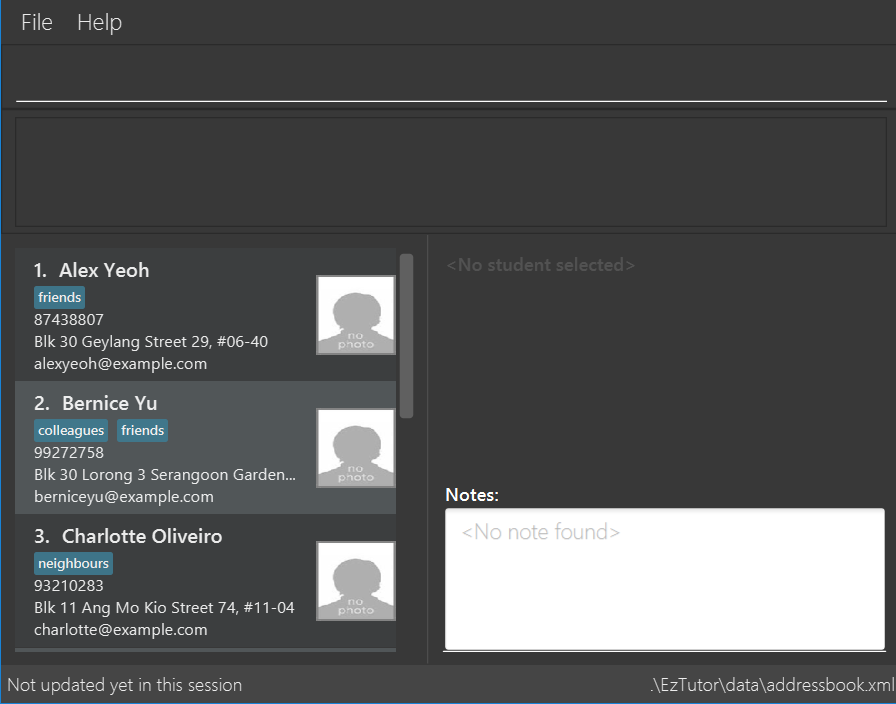

= EazyTutors
ifdef::env-github,env-browser[:relfileprefix: docs/]

https://travis-ci.org/CS2103-AY1819S1-W12-4/main[image:https://travis-ci.org/CS2103-AY1819S1-W12-4/main.svg?branch=master[Build Status]]
https://ci.appveyor.com/project/spencertan96/main[image:https://ci.appveyor.com/api/projects/status/16rotceog2iv3617?svg=true[Build Status]]
https://coveralls.io/github/CS2103-AY1819S1-W12-4/main?branch=master[image:https://coveralls.io/repos/github/CS2103-AY1819S1-W12-4/main/badge.svg?branch=master[Coverage Status]]

ifdef::env-github[]

endif::[]

ifndef::env-github[]
image::images/Ui.png[width="600"]
endif::[]

*This is a desktop Student Management application for NUS tutors to manage their administrative tasks.*
*It has a GUI but most of the user interactions happen using a CLI (Command Line Interface).*
*This application helps NUS tutors to track student's attendance, participation, submissions and grades for their modules.*
*It is written in OOP fashion.*
*What's good about this project:*
*A more sophisticated GUI that includes a list  panel and an in-built statistics calculator.*
*More test cases, including automated GUI testing.*
*Support for _Build Automation_ using Gradle and for _Continuous Integration_ using Travis CI.*

== Site Map

* <<UserGuide#, User Guide>>
* <<DeveloperGuide#, Developer Guide>>
* <<AboutUs#, About Us>>
* <<ContactUs#, Contact Us>>

== Acknowledgements

* Forked from https://github.com/nus-cs2103-AY1819S1/addressbook-level4[Address Book (Level 4)]
* Some parts of this application were inspired by the excellent http://code.makery.ch/library/javafx-8-tutorial/[Java FX tutorial] by
_Marco Jakob_.
* Code from SE-EDU was used in this application.
* Libraries used: https://github.com/TestFX/TestFX[TextFX], https://bitbucket.org/controlsfx/controlsfx/[ControlsFX], https://github.com/FasterXML/jackson[Jackson], https://github.com/google/guava[Guava], https://github.com/junit-team/junit5[JUnit5]

== Licence : link:LICENSE[MIT]
